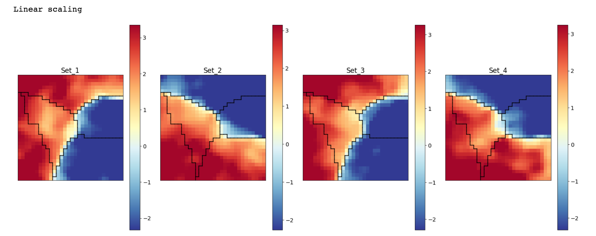

# MSESOM
## About
This repository contains a the universal portion of the work done in the Huang group in MSE at the University of Washington.

## Initial Steps
- Have python on PC either via Miniconda or Anaconda
- Have git installed via this link:
- Configure your git bash to your account using command below
 - git config --global user.email ”user@email.com”
- Move to the place where you would like the repository (ex below)
- Follow installation instructions

## How To Install Repo
Follow steps below:
1. git clone https://github.com/feliciatd/MSESOM.git. Another option is to fork this github to your personal github and clone from there.
2. cd MSESOM
3. pip install -r requirements.txt
4. Download internal folder on to computer in the same folder
5. Test to see if the first few cells of Sompy_experimentation runs with no error

## How to Know If It Works
1. Run Sompy_experimentation with the Dummy Data
2. Take the produced .h5 file and use in SOM_Visualization. The results produced should be as follows:
#### Linear Scaling

#### Log Scaling

#### U Matrix

## Notes
### Troubleshooting
#### Red Text or Error Downloading requirements.txt
- Look at what package produced the error
- pip install package
- rerun pip install requirements.txt

#### Inability to Run code
Some of the conda packages are named differently than in pip. For example, sklearn -> scikit-learn and tables -> pytables. Additionally, conda does not automatically download packages from a URL, so there is need to clone sevamoo's SOMPY into the directory manually and then run setup.py to manually install sevamoo's SOMPY.

## Sources
Tim Letz's github for original SOM_Visualization and Sompy_experimentation: https://github.com/timletz/materials_datascience_uw_somlab

matplotlib github for dummydata: https://github.com/matplotlib/matplotlib

Sevamoo's SOMPY: https://github.com/sevamoo/SOMPY
